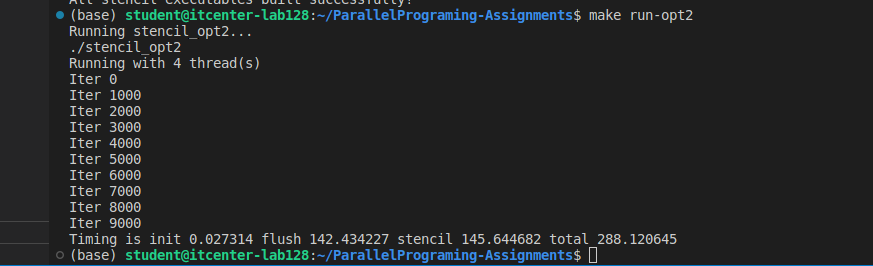
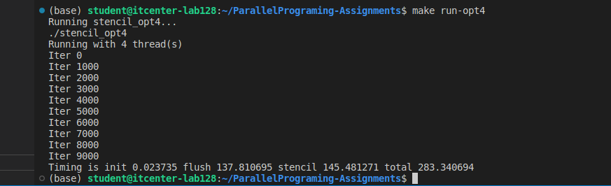
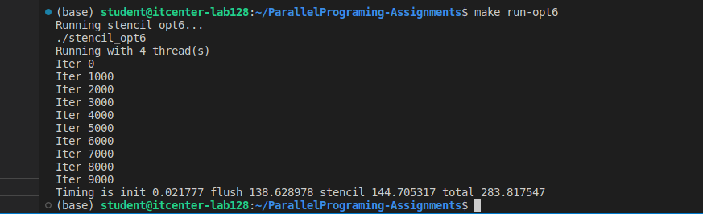

(base) student@itcenter-lab128:~/ParallelPrograming-Assignments$ make run-opt2
Running stencil_opt2...
./stencil_opt2
Running with 4 thread(s)
Iter 0
Iter 1000
Iter 2000
Iter 3000
Iter 4000
Iter 5000
Iter 6000
Iter 7000
Iter 8000
Iter 9000
Timing is init 0.027314 flush 142.434227 stencil 145.644682 total 288.120645
(base) student@itcenter-lab128:~/ParallelPrograming-Assignments$ make run-opt4
Running stencil_opt4...
./stencil_opt4
Running with 4 thread(s)
Iter 0
Iter 1000
Iter 2000
Iter 3000
Iter 4000
Iter 5000
Iter 6000
Iter 7000
Iter 8000
Iter 9000
Timing is init 0.023735 flush 137.810695 stencil 145.481271 total 283.340694
(base) student@itcenter-lab128:~/ParallelPrograming-Assignments$ make run-opt6
Running stencil_opt6...
./stencil_opt6
Running with 4 thread(s)
Iter 0
Iter 1000
Iter 2000
Iter 3000
Iter 4000
Iter 5000
Iter 6000
Iter 7000
Iter 8000
Iter 9000
Timing is init 0.021777 flush 138.628978 stencil 144.705317 total 283.817547

Explaination of differences between these three optimizations: 
    
    stencil_opt2: This version creates a new OpenMP parallel region for each loop, causing high overload and slower execution time. 

    stencil_opt4: This uses a single parallel region for the entire itereation, reducing thread creation overhead and sligthly improving performance.   

    stencil_opt6: This manually divides work among all the threads, improving data locality and minimizing synchronization, but the total runtime is similar to the version before because the program became memory-bandwidth limited.

    From version to version, the performance improves, mainly due to reduced threading overhead and better parallel workload management. 

1) How many threads your CPU used to execute the code? 

    My CPU has used 4 threads to execute the code. 

2) What are the parts of the code that were improved? What strategies were used to improve the code? 

    stencil_opt2.c: This version uses #pragma omp parallel for loops for initialization and stencil computation. 

    stencil_opt4.c: This version moves the main for loop inside one #pragma omp parallel region to avoid starting and stopping parallel sections, again and again. Also, it uses nowait statement to remove unnecessary barriers. 

    stencil_opt6.c: This version manually divides work among all threads to minimize synchronization, uses fewer barriers and it optimizes memory access by assigning thread-specific loop bounds. 

3) What is the difference between explicit and implicit barriers inside the code and did they exist inside any of these examples? What do they actually mean? 

    Implicit barriers happen automatically at the end of most OpenMP constructs like #pragma omp for or #pragma omp parallel, unless the nowait statement is used. 
    This actually means that threads wait for all the other threads to finish some loop or section before moving forward.
    In our code, stencil_opt2.c every #pragma omp parallel for ends with an implicit barrier, so all the threads finish their loop before entering the next loop. 

    Explicit barriers, on the other hand, are added manually by the developer using #pragma omp barrier. It is used when you need synchronization at some specific point. 
    In our code, stencil_opt6.c, explicit barriers are placed after initizalition and stencil steps to make sure all the threads complete those parts before continuing forward. 

    Images:

    
    
    