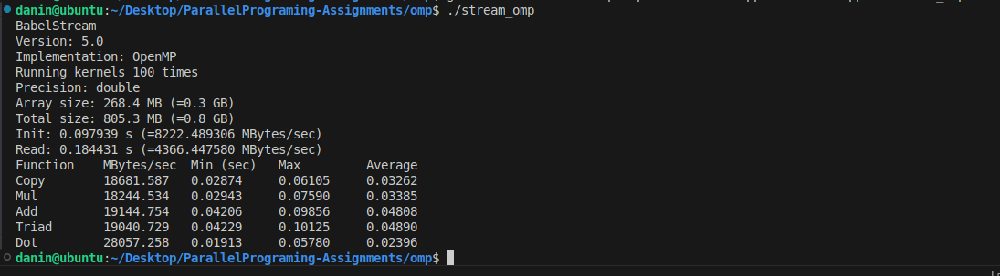

OpenMP (CPU) benchmark: 

Initialization results

Init: 0.097939s (8222 MB/s) - Speed of initializing arrays with values
Read: 0.184431 (4366 MB/s) - Speed of reading data from memory 

1. Copy (18681 MB/s (bandwidth)): a[i] = b[i]
    Best perfomarmance (min) = 0.02874 MB/s, worst performance (max) = (0.06105) MB/s and average performance = 0.03262 MB/s.

2. Mul (18244 MB/s): b[i] = scalar * c[i]
    Min = 0.02943 MB/s, Max = 0.06105 MB/s and Avg = 0.03385 MB/s

3. Add (19144 MB/s): c[i] = a[i] + b[i]
    Min = 0.04206 MB/s, Max = 0.09856 MB/s and Avg = 0.04808 MB/s

4. Triad (19040 MB/s): b[i] + scalar * c[i]
    Min = 0.04229 MB/s, Max = 0.10125 MB/s and Avg = 0.04890 MB/s

5. Dot (28057 MB/s): sum += a[i] * b[i]
    Min = 0.01913 MB/s, Max = 0.05780 MB/s and Avg = 0.02396 MB/s

For the most demanding operation (Triad), my system has achieved (~19 GB/s) sustained memory throughput. Dot achieves the highest throughput out of all operations (~28 GB/s), which is expected due to efficient reduction operations and cache reuse. CPU performance is limited by system memory bandwidth and my results fall within the typical range for DDR4 memory (10 - 25 GB/s). 
