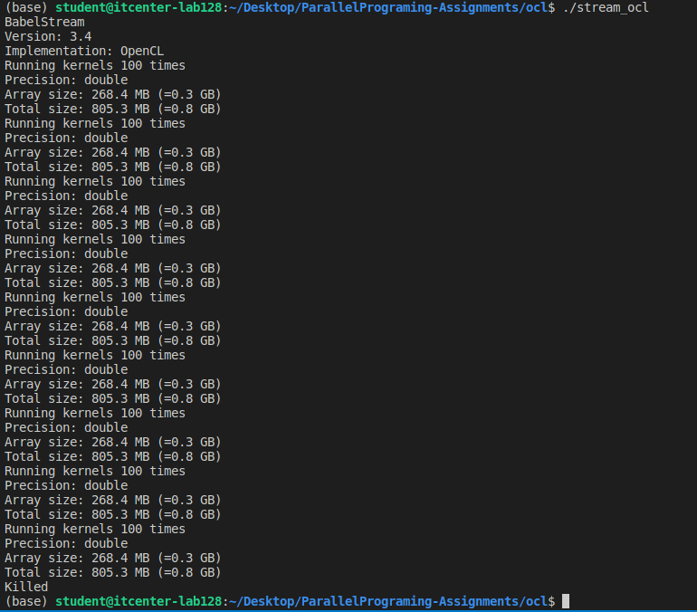
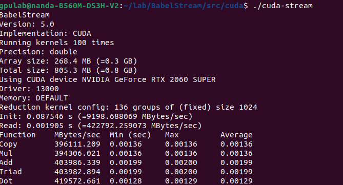

OpenMP (CPU) benchmark: 

Initialization results

Init: 0.097939s (8222 MB/s) - Speed of initializing arrays with values
Read: 0.184431 (4366 MB/s) - Speed of reading data from memory 

1. Copy (18681 MB/s (bandwidth)): a[i] = b[i]
    Best perfomarmance (min) = 0.02874 MB/s, worst performance (max) = (0.06105) MB/s and average performance = 0.03262 MB/s.

2. Mul (18244 MB/s): b[i] = scalar * c[i]
    Min = 0.02943 MB/s, Max = 0.06105 MB/s and Avg = 0.03385 MB/s

3. Add (19144 MB/s): c[i] = a[i] + b[i]
    Min = 0.04206 MB/s, Max = 0.09856 MB/s and Avg = 0.04808 MB/s

4. Triad (19040 MB/s): b[i] + scalar * c[i]
    Min = 0.04229 MB/s, Max = 0.10125 MB/s and Avg = 0.04890 MB/s

5. Dot (28057 MB/s): sum += a[i] * b[i]
    Min = 0.01913 MB/s, Max = 0.05780 MB/s and Avg = 0.02396 MB/s

For the most demanding operation (Triad), my system has achieved (~19 GB/s) sustained memory throughput. Dot achieves the highest throughput out of all operations (~28 GB/s), which is expected due to efficient reduction operations and cache reuse. CPU performance is limited by system memory bandwidth and my results fall within the typical range for DDR4 memory (10 - 25 GB/s). 

iGPU Benchmark: 

It is not possible to run iGPU test benchmark on this PC. Its always starts the loops and at the end the process gets killed. Probably this PC does not have the iGPU or it has insufficient resource allocation.

GPU Benchmark: 

gpulab@nanda-B560M-DS3H-V2:~/lab/BabelStream/src/cuda$ ./cuda-stream 
BabelStream
Version: 5.0
Implementation: CUDA
Running kernels 100 times
Precision: double
Array size: 268.4 MB (=0.3 GB)
Total size: 805.3 MB (=0.8 GB)
Using CUDA device NVIDIA GeForce RTX 2060 SUPER
Driver: 13000
Memory: DEFAULT
Reduction kernel config: 136 groups of (fixed) size 1024
Init: 0.087546 s (=9198.688069 MBytes/sec)
Read: 0.001905 s (=422792.259073 MBytes/sec)
Function    MBytes/sec  Min (sec)   Max         Average     
Copy        396111.209  0.00136     0.00136     0.00136     
Mul         394306.021  0.00136     0.00136     0.00136     
Add         403986.339  0.00199     0.00200     0.00199     
Triad       403982.894  0.00199     0.00200     0.00199     
Dot         419572.661  0.00128     0.00129     0.00129 

Shown in the Reduction Kernel config, there were 136 groups of size 1024. We will get the threads when we multiply those two numbers (136 * 1024 = 139264). This means there were 139364 threads used to finish these operations. 

In this assignment, unfortunately we cannot compare GPU or CPU with iGPU, we can only compare CPU with the GPU, so here is the comparison:

For the most intensive operation (Triad), the dedicated GPU performs a lot better, which was expected, than the CPU. Evene the worst case of GPU for Triad (0.00200 MB/s) was much much better than the CPU's best case (0.04229 MB/s). The superiority on other operations, does not need to be mentioned as we can clearly see that the GPU outperforms CPU. The GPU achieves over 400 GB/s of memory throughput, which is more than 20x higher than the CPU. This major difference is due to GPU's high-bandwidth memory and its highly parallel architecture, which is optimized for simultaneous execution of thousand of threads on simple, repeated operations. The CPU is constrained by the slower system memory.  