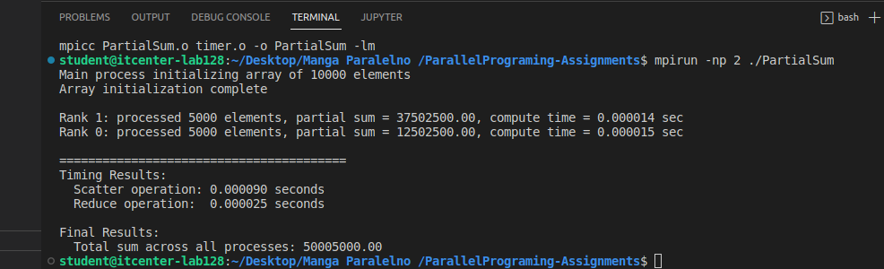

MPI_Allgather: Collect the local array sizes from all processes and distributes them to ranks. Each process must know exactly how many elements every other process will receive so that we can compute offsets for MPI_Scatterv. 

MPI_Allgather(&nsize, 1, MPI_INT,
              nsizes, 1, MPI_INT,
              comm);

MPI_Scatterv: Distributes variable-sized chucnks of global array from rank 0 to all other ranks. The data may not be evenly divisible by the number of processes, MPI_Scatterv lets us give different number of elements to different ranks. 

MPI_Scatterv(a_global, nsizes, offsets, MPI_DOUBLE,
             a_local, nsize, MPI_DOUBLE, 0, comm);

MPI_Reduce: Collects all local partial sums and computes the final sum at rank 0. 

MPI_Reduce(&local_sum, &total_sum, 1, MPI_DOUBLE, MPI_SUM, 0, comm);

We implemented this part of code to correctly distribute data, even when the division leaves a reminder. 

int base = ncells / nprocs;
int rem  = ncells % nprocs;

int nsize = base + (rank < rem ? 1 : 0);
int start = rank * base + (rank < rem ? rank : rem);

Local memory allocation: Each rank allocates memory for its part of the global array. 

double *a_local = (double *)malloc(nsize * sizeof(double));
if (a_local == NULL) {
    fprintf(stderr, "Rank %d: failed to allocate a_local\n", rank);
    MPI_Abort(comm, 1);
}

Rank 0 and Rank 1 each receive 5000 elements. 
Computation time is extremely small due to local summation. 
Scatter and Reduce operations takes microsecods. 
Result: 5000500000

Run with 4 and 8 processes is not possible due to this system not having neither 4 or 8 processes. If it does not have 4, logically it does not have 8. MPI reported insufficient slots. 