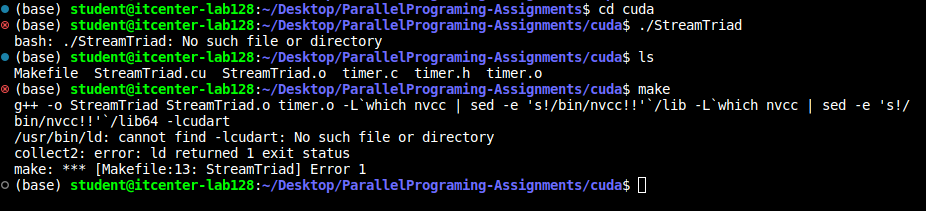
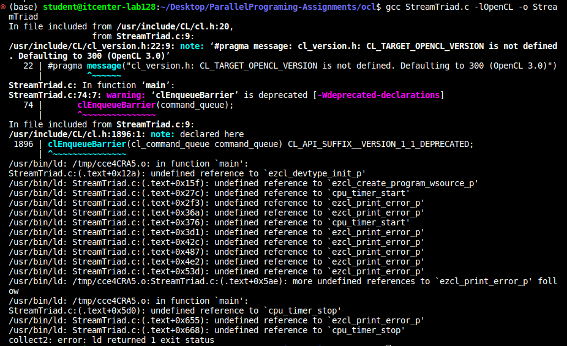
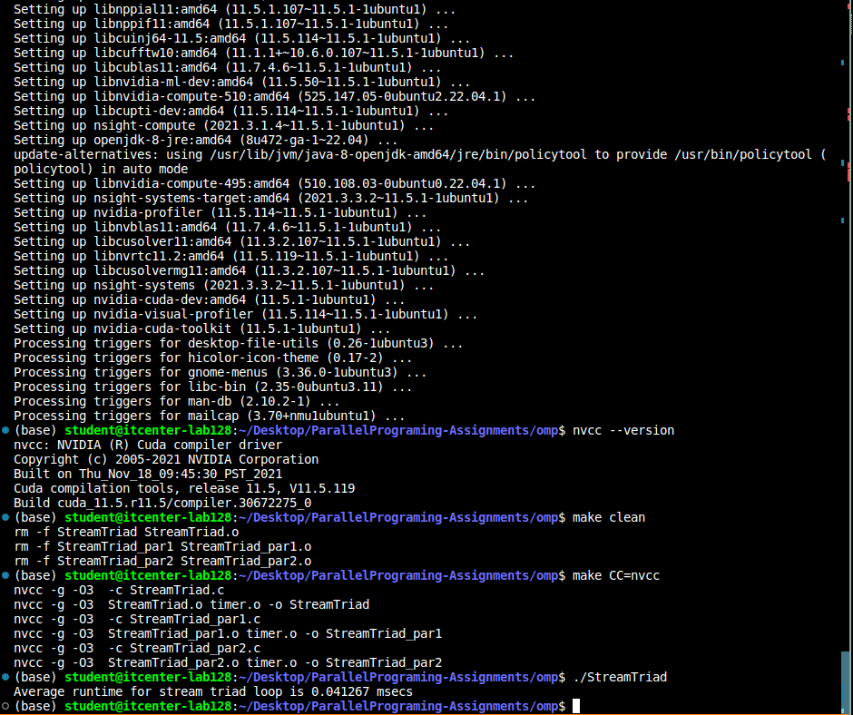
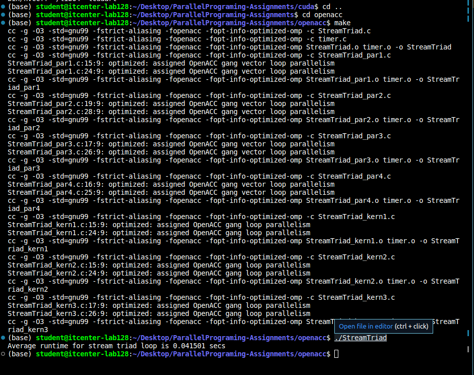
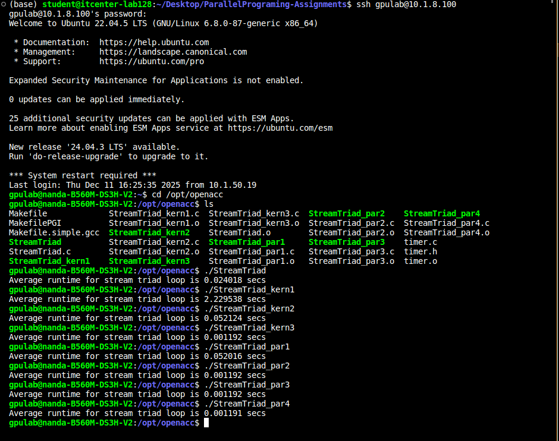

I cannot run cuda test, because lab`s PC does not have dedicated NVIDIA GPU. I cannot Make this file, because of the same problem. 

When it comes to running ocl, it is not possible due to compiler not successing to map the needed references. It says undefined reference to ..., it is not possible to run it, so I cannot test it. 

This test was successful, but we had to implement some changes. This code is old, and this code was run and tested on old version of Nvidia C Compiler (nvcc). The old command was "-qthreaded" and in new version of compiler it is "-pthread". I did not have nvcc on this PC, I had to install it, and after that in the OMP Makefile, I had to delete all the flags except -g -03- When I done that, I could run the code and got with this result: Average runtime for stream triad loop is 0.041267 msecs. 

This test was successful without any problems and got the result: Average runtime for stream triad loop is 0.041501 secs. This was successful because it uses high level compiler which hides memory management details and device discovery. Even without GPU, OpenACC can be executed, thanks to CPU path. 

Testing this code, we got different results, some were pretty slow while other were quite the opposite. The worst runtime had Kernel 1 with ~2.22s. Why? Because it fails to parallelize the loops. 
Kernel 2 had better runtime, but still slower than the serial code execution, because it added the compute region (~0.052s). Where the real speed comes from, is from Kernel 3 with the runtime of 0.001s, thanks to adding dynamic data region. When it comes to parallelizing the code, parallelize tests, Parallel 1 produced the worst runtime with ~0.52s, slower than the serial code. Parallel 2 added structured data region and got with with same result Parallel 3, which added dynamic data structure (0.001192s). Finally, Parralel 4 allocates data only on device and got the best runtime of 0.001191s.  