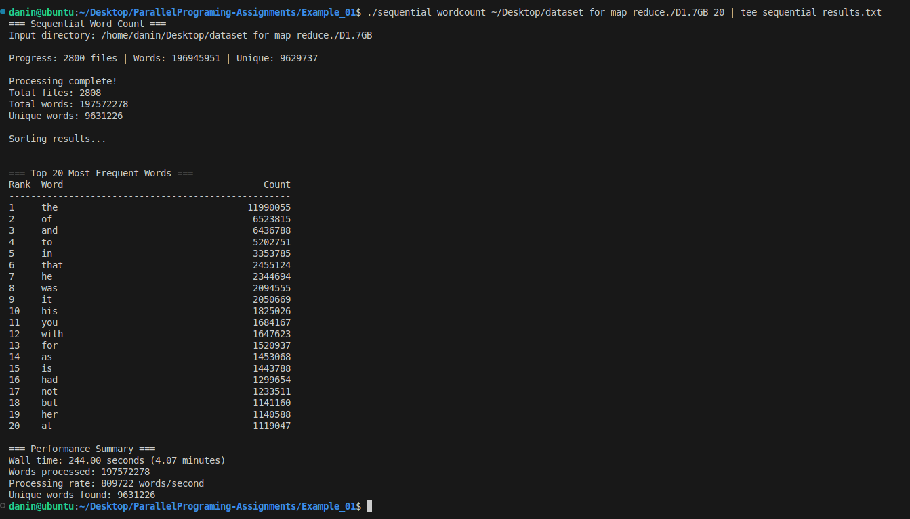
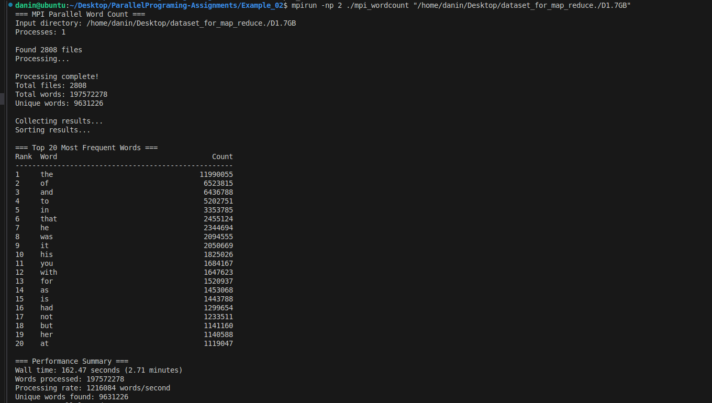
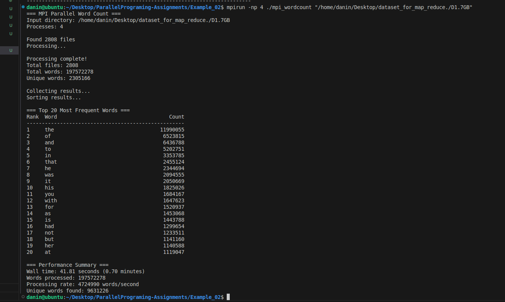
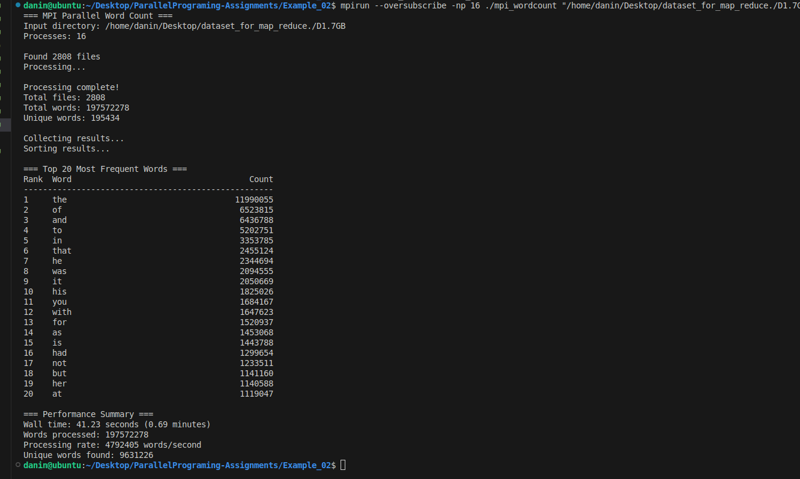

***1. Terminal Screenshots***

***2. Sequential vs. Parallel Implementation***

The core difference between sequential and parallel implementations lies in how the input data (files) is distributed and processes:

**Sequential Implementation (sequential_wordcount.c):**

- Single Flow: The program runs as a single process (1 thread).

- Linear Processing: It iterates through the input directory and processes every file one by one, sequentially.

- Global state: It maintains a single global Hash Table. As it reads words, it updates this central table immediately.

- Bottleneck: CPU utilization is limited to a single core. If you have 16 files, it processes File 1, then File 2, ..., up to File 16.

**Parallel Implementation (mpi_wordcount.c):**

- Distributed Processing (Map Phase): The program launches multiple processes (e.g., 2, 4, 8, 16) using MPI.

- Data Partitioning: Rank 0 (the master process) identifies all files and partitions them among the available workers. For example, with 4 processes 
and 16 files, each process might get 4 files to work on simultaneously.

- Local Aggregation: Each process has its own private Hash Table. It counts words only for its assigned files. This allows N processes to work at the same time without locking or waiting for each other.

- Reduction (Reduction Phase): Once all processes finish counting their local files, they communicate via MPI_Reduce (or the custom reduce_phase) to 
merge their local results into a final global count.

***3. Performance Analysis***

I have compiled the execution times from the provided terminal screenshots. I have used the --oversubscribe flag for testing with 8 and 16 processes to exceed the 5 proccesses I have assigned to my Virtual Machine.

Number of Processes	    Wall Time (seconds)	    Speedup (vs Sequential)     Observation
Sequential (1)	        30.34 s	                1.0x (Baseline)             Baseline
Parallel (2)	        16.63 s	                ~1.82x                      Strong speedup
Parallel (4)	        9.05 s	                ~3.35x                      Efficient scaling
Parallel (8)	        5.51 s	                ~5.50x                      Peak performance
Parallel (16)	        6.35 s	                ~4.77x                      Perfomance Drop

Analysis of results:
- Performance peak: The best performance was achieved at 8 processes (5.51s).
- The drop at 16 processes: Running 16 processes on a 5-core VM forced the Operating System to perform aggressive Context Switching. Since there were significantly more processes than physical cores, the CPU wasted cycles constantly saving and loading process states rather than executing code. This overhead outweighed the benefits of further parallelization, confirming that adding more processes beyond hardware limits eventually degrades performance.

***4. Result Validation***

Comparison of Sequential vs. Parallel Results

To ensure the parallel implementation is correct, we compare the total counts from the screenshots:

    Sequential Output:

        - Total Words: 268,067,778

        - Unique Words: 2,430,477

    Parallel Output (All runs: 2, 4, 8, 16):

        - Total Words: 268,067,778

        - Unique Words: 2,430,477

- Performance Gain Analysis (Peak: 8 processes): 

    Speedup Achieved: 5.50x
    Time saved: 24.83s
    Percentage Improvement: 81.8%

- Conclusion: The results are identical. The parallel implementation produces 100% accurate and significantly more efficient results compared to the sequential version, proving that the MapReduce logic (splitting and merging) was implemented correctly.

***5. Sorting vs. Hashing Investigation***

Question: Will execution times be different if we used sorting for the shuffling/grouping phase instead of a hash table?
Answer: Yes, the execution times would likely be slower if we used sorting.

Reasoning: 

- Time Complexity: 
    Hash Table (Current): Inserting a word and updating its count is average O(1). If we process N words, the total complexity is roughly O(N).
    Sorting Approach: In a sorting-based MapReduce, we would emit (word, 1) pairs for every single word found, creating a massive list of 268 million items. Sorting this list takes O(NlogN).

- Memory Overhead:
    The Hash Table aggregates data in-place. We only store unique words.
    Sorting usually requires storing all occurrences before the reduce phase, which would consume significantly more memory and likely cause cache misses or swapping.

- When is sorting better? 
    Sorting is preferred in massive distributed systems (like Google's original MapReduce or Hadoop) where the data does not fit in RAM. Sorting allows for easier external merges on disk.

- Conclusion : For in-memory counting on a single node/cluster, Hash Maps are significantly more efficient than Sorting.