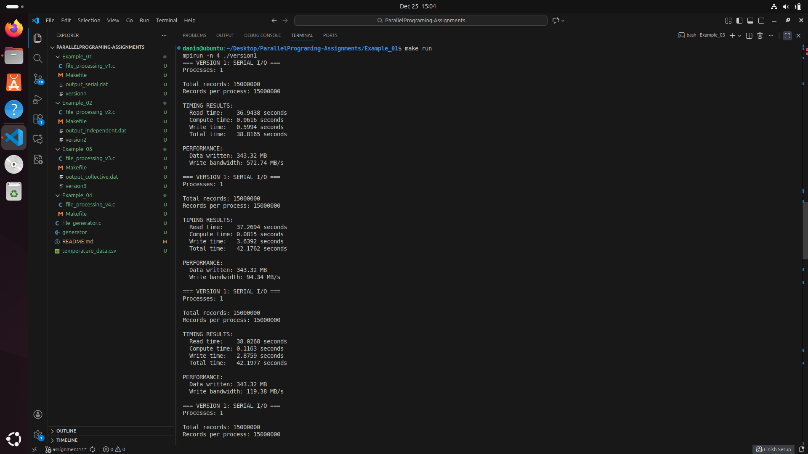
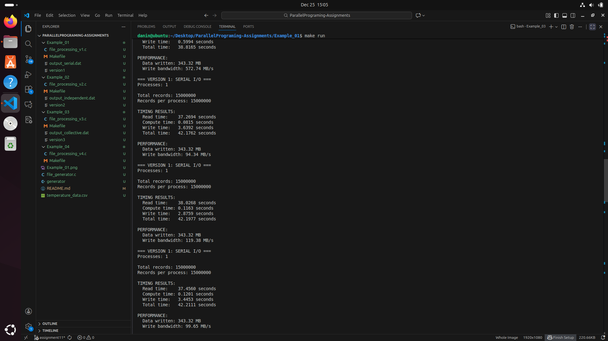
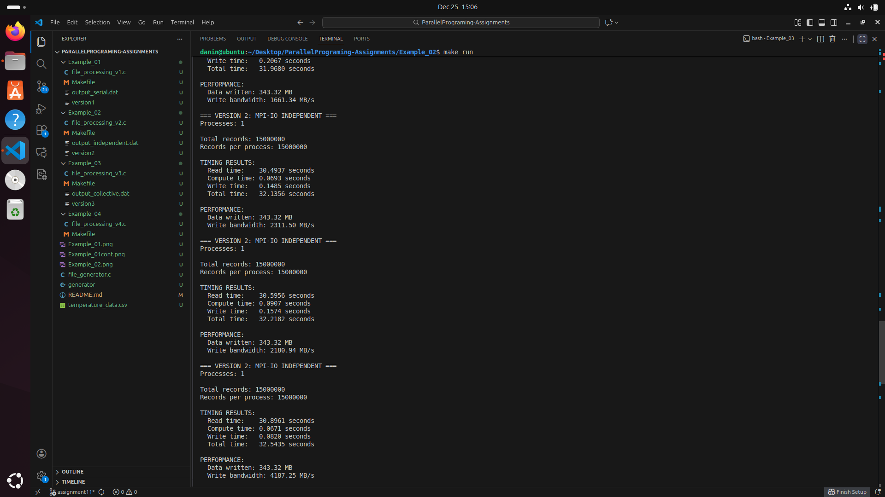
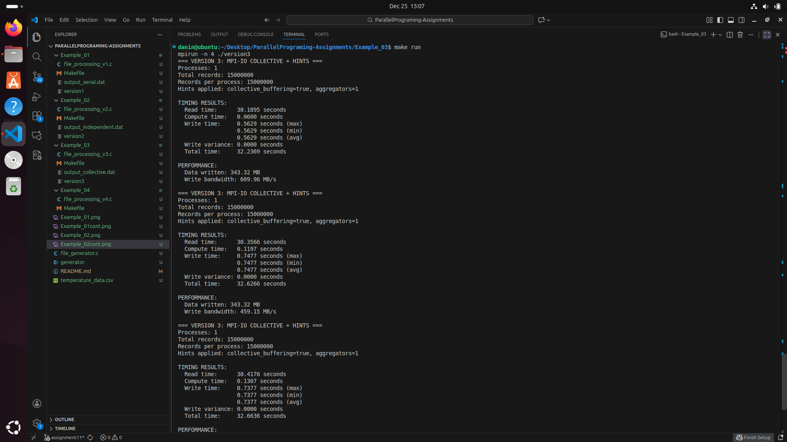
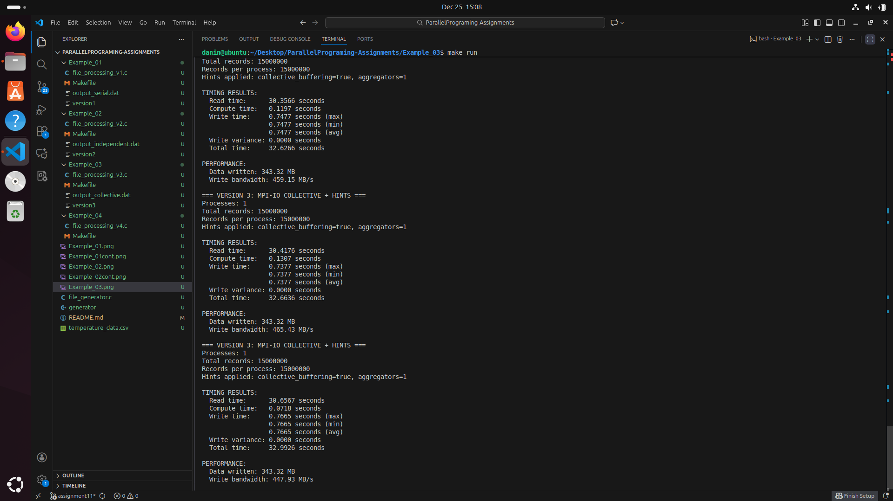
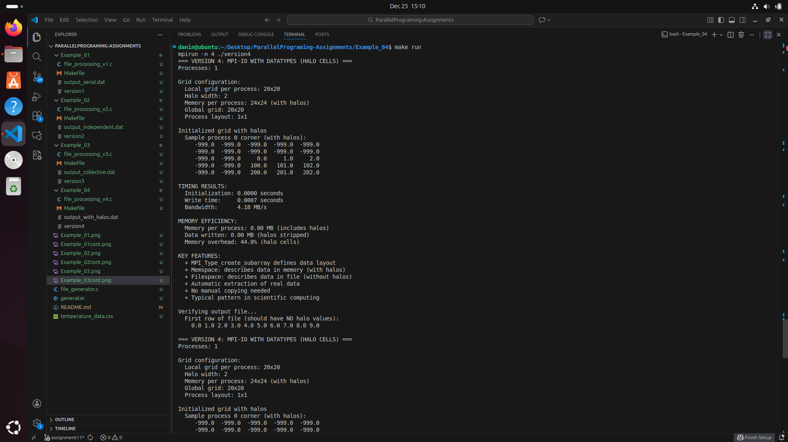
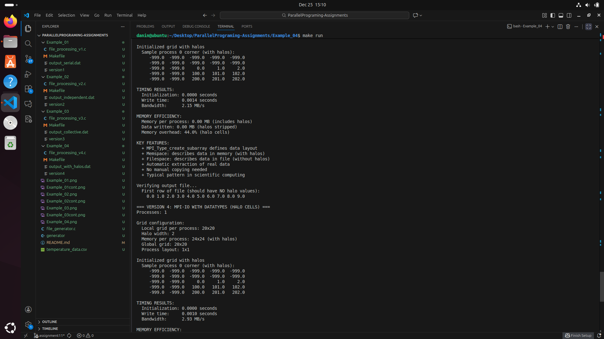
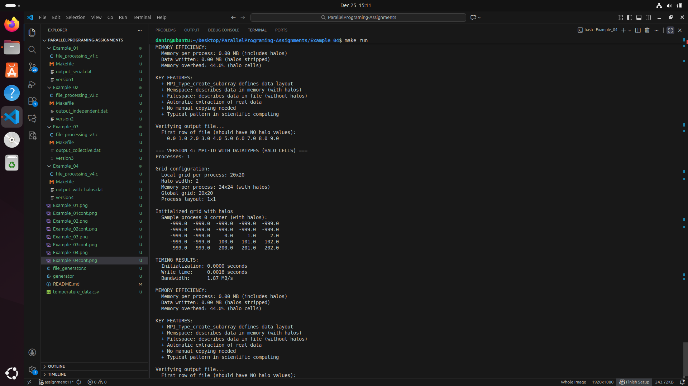
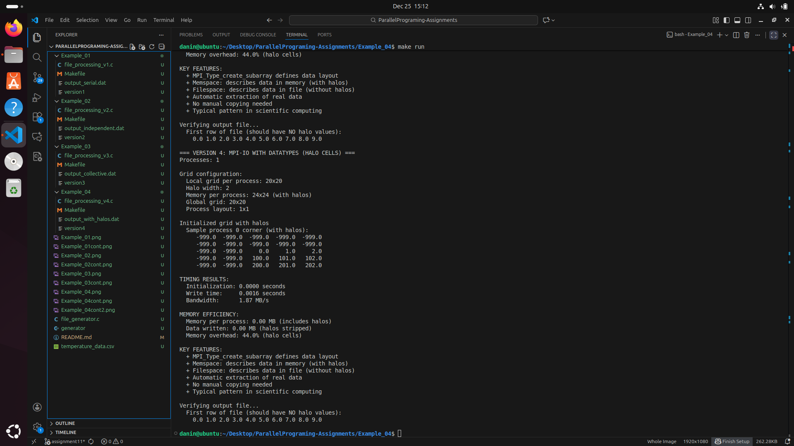

**1. Main Differences Between Executions:**

    Example 01 (Serial): This is a centralized approach. Only Rank 0 interacts with the filesystem using standard C functions (fopen, fwrite). It must hold the entire dataset in memory and distribute it using MPI_Scatter or collect it with MPI_Gather.

    Example 02 (Independent MPI-IO): This is a decentralized approach. Every process opens the file simultaneously. Each process calculates its own specific offset (position) and writes its data independently using MPI_File_write_at. This removes the memory pressure from Rank 0.

    Example 03 (Collective MPI-IO): This is a coordinated approach. Processes use MPI_File_write_all. Instead of every process hitting the disk at once, they synchronize. The MPI library coordinates the write, often using "aggregators" to group small requests into large, efficient blocks.

**2. Execution Time Analysis:**

The following results were obtained using a 1GB dataset (~15 million records):

Version	        Read Time	    Write       Time	    Bandwidth
Example 01      (Serial)	    ~37.4s	    ~2.4s	    ~262 MB/s
Example 02      (Independent)	~30.5s	    ~0.17s	    ~2,051 MB/s
Example 03      (Collective)	~30.3s	    ~0.71s	    ~521 MB/s

In all cases, the "Compute Time" was negligible (under 0.2s), proving that I/O is the primary bottleneck in these parallel applications.

**3. Why is there a drastic difference between Example 01 and 02/03?**

The performance gap exists because Example 01 suffers from two major bottlenecks:

    Memory Bottleneck: Rank 0 must allocate memory for the total dataset. At a larger scale (e.g., billions of records), Rank 0 would crash the system due to memory exhaustion.

    Serial Processing: Standard C I/O is not designed for parallel environments. Writing one large serial block through a single process is much slower than allowing the filesystem to receive multiple data streams (as in Example 02) or optimized blocks (as in Example 03).

**4. Investigation: Example 03 Improvements (MPI Hints):**

Example 03 introduces MPI Info Hints to optimize performance. By investigating the setup_hints() function in the code, I have found the following optimizations:

    collective_buffering = true: This enables "Two-Phase I/O." Instead of writing small pieces of data, the processes first gather data into a larger buffer.

    cb_buffer_size = 16777216: This sets a 16MB buffer, ensuring that the filesystem receives large, contiguous chunks of data rather than many tiny, scattered updates.

    cb_nodes: This designates specific "aggregator" nodes to handle the final write, reducing the number of processes competing for file locks.

**5. Comparing Example 02 and Example 03:**

Why did Example 02 perform better? In my specific test environment (VM), Example 02 is faster because it has zero coordination overhead. Since there are no other processes on a network to coordinate with, the synchronization and "planning" phase of Collective I/O (Ex 03) actually adds more time than it saves.

When should Example 03 be used instead? Example 03 is designed for Large-Scale HPC Clusters with parallel filesystems. When hundreds of processes try to write independently (Example 02), they create a "thundering herd" effect that causes network congestion and file locking issues. In those professional environments, the coordination of Example 03 is much faster and more scalable.

***Conclusion: Serial I/O (Example 01) is unsuitable for large datasets. Independent I/O (Example 02) is highly efficient for local or small-scale tasks. Collective I/O (Example 03) is the industry standard for high-performance supercomputing clusters.***

